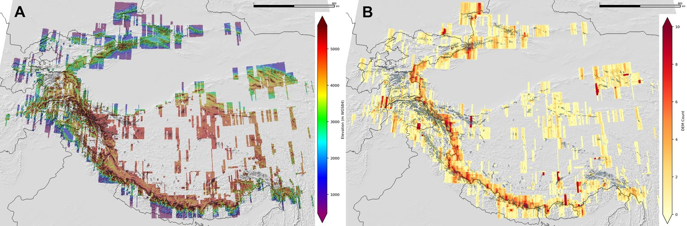
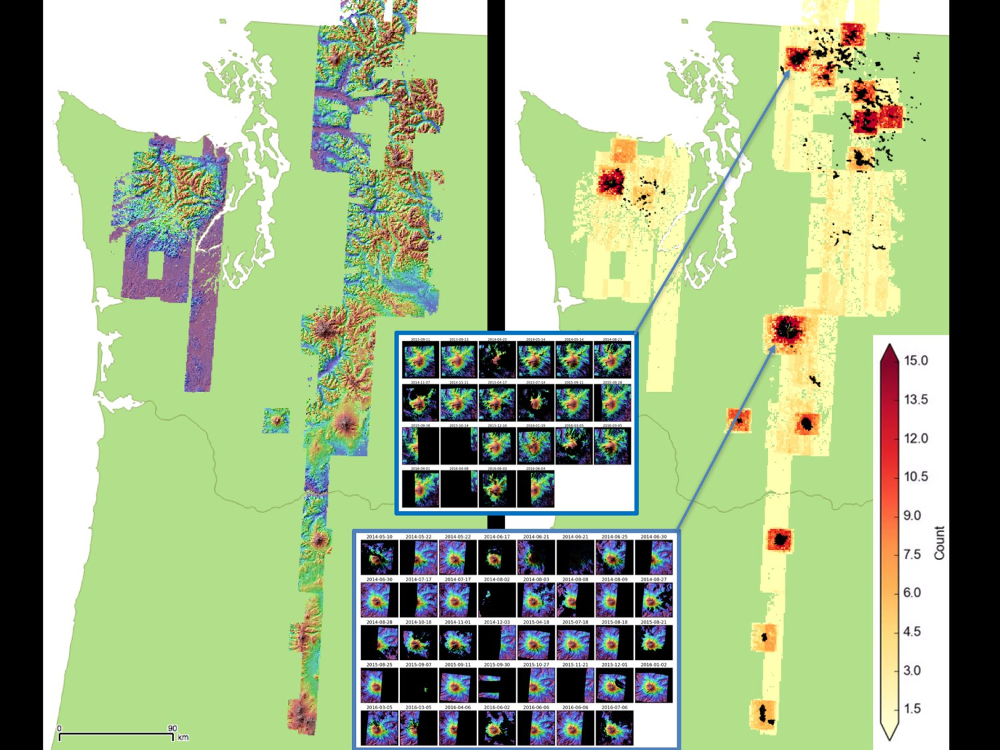

# glacierhack2017
Code and notes for the 2017 UW eScience geohackweek GlacierHack project

## Objectives
- To learn new skills to work with large raster datasets, specifically high-resolution DEMs
- Learn how to calcluate elevation change, volume change, and geodetic mass balance from DEM time series
- Explore options to integrate DEM time series into Google Earth Engine
- Explore options to implement various processing steps in Google Earth Engine or other cloud-based processing platform

## Background material
- Rainier DEM Example from ghw2017 raster tutorial: https://geohackweek.github.io/raster/06-pygeotools_rainier/

## Packages
- GDAL
- NumPy
- pygeotools
- demcoreg
- vmap
- Ames Stereo Pipeline (download precompiled binaries [here](https://ti.arc.nasa.gov/tech/asr/intelligent-robotics/ngt/stereo/) and add bin directory to your PATH)

## Sub-projects

### Geodetic mass balance
Lead(s): @mattols

Sources of input data:
- High-resolution DEMs derived from stereo imagery
- SRTM 1-arcsec data (30-m)

### Feature-tracking and velocity map time series
Lead(s):

We will explore [vmap](https://github.com/dshean/vmap) tools (wrappers around the Ames Stereo Pipeline correlator) to generate time series of velocity maps.  

Sources of input data for velocity maps include:
- High-resolution image data from DigitalGlobe, Planet, LS8, Sentinel, etc.
- High-resolution shaded relief maps derived from 2-m Stereo DEMs (see 

### Debris thickness modeling
Lead(s): @drounce

Attempt to estimate debris thickness using LS thermal IR imagery, output from an energy balance model, and observed elevation change data

### Lagrangian elevation change for mountain glaciers
Lead(s): @dshean

Integrate elevation change and velocity measurements to extract Lagrangian Dh/Dt and local debris thickness change maps for comparison with debris thickness models.

## Candidate sites
Let's identify one or more sites with a good, dense time series of DEM/image data.  See count maps and indices.

### High-mountain Asia

Index of available DEMs: https://drive.google.com/open?id=0B5c3UTO8DDZwNkktcGtBSXJvQjQ

### Pacific NW (Mt. Rainier, Mt. Baker, Mt Olympus, etc.)

Index of available DEMs: https://drive.google.com/file/d/0B5c3UTO8DDZwNDFvWkQ0bFdsa0U

### Other candidates
- Alaska (using [ArcticDEM](https://www.pgc.umn.edu/data/arcticdem/) products)
- Oso landslide, WA
- Greenland outlet glaciers
- SnowEx'17 sites: Grand Mesa and Senator Beck Basin, CO
